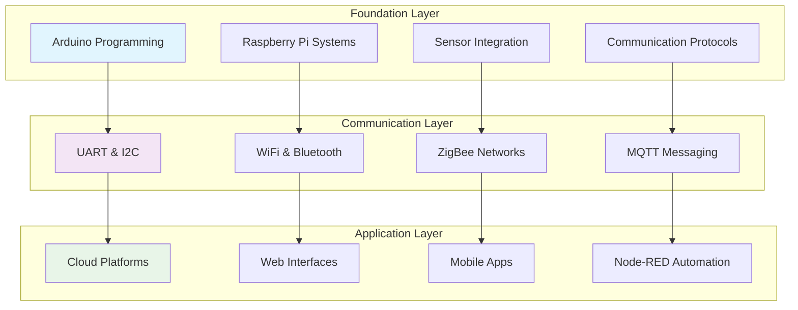
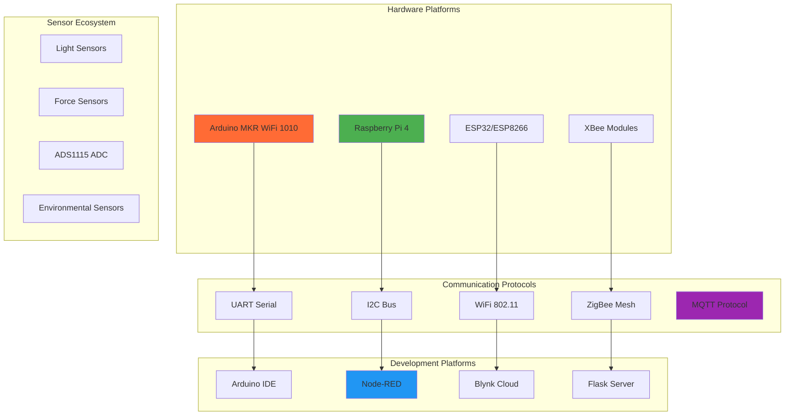
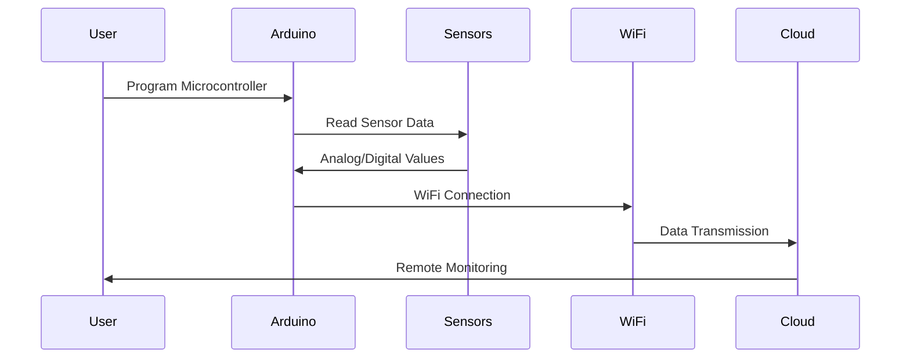
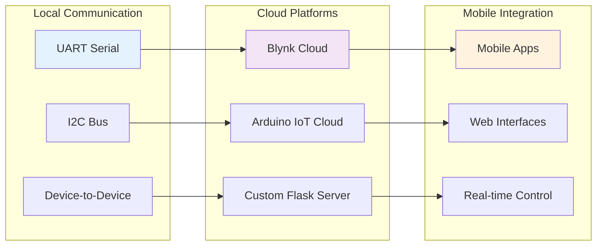
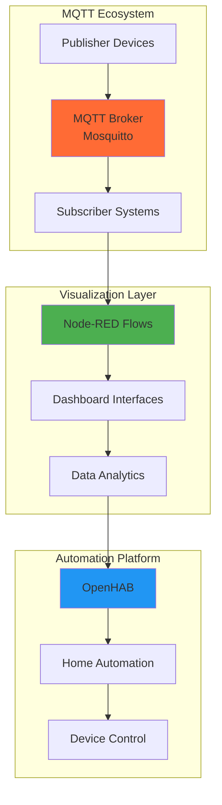
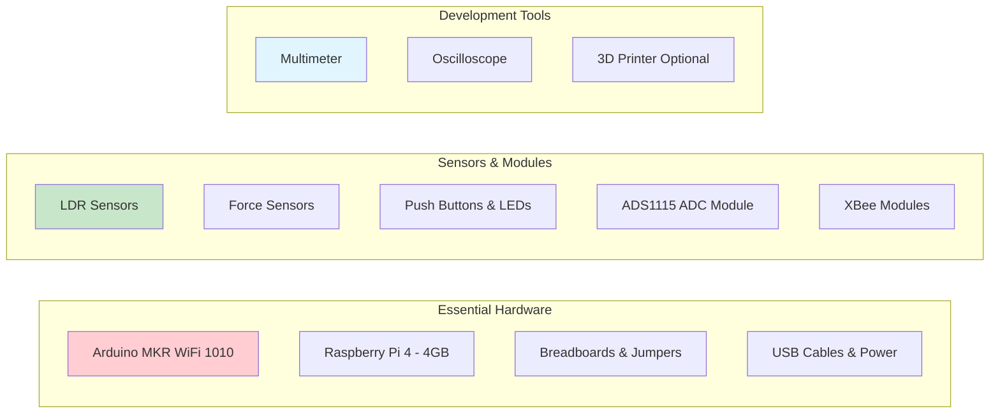
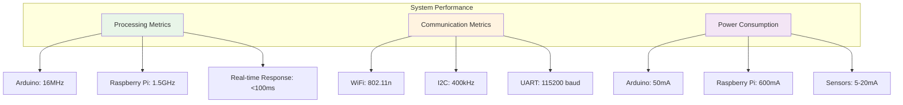
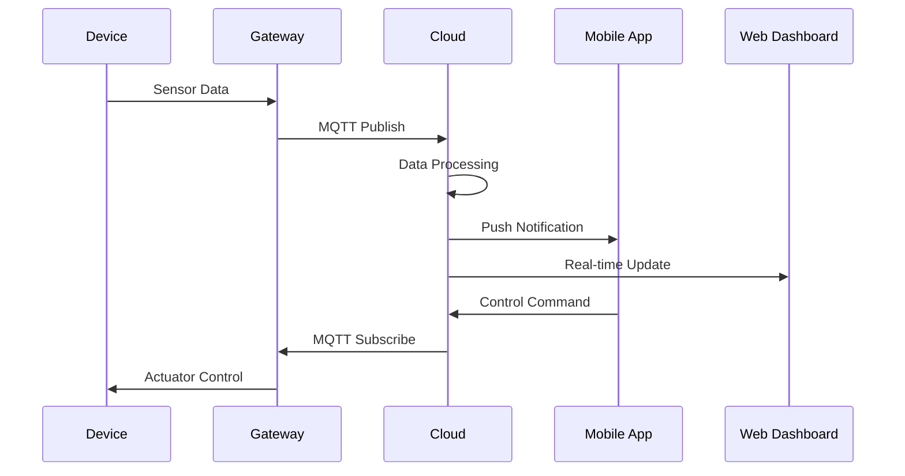

# ICS Labs - Intelligent and Communicating Systems

**Advanced IoT laboratory repository with hands-on embedded systems programming and modern connected device implementations**


## Overview

A comprehensive educational ecosystem for modern IoT development, covering the complete spectrum from basic microcontroller programming to advanced distributed systems. This repository delivers hands-on experience with industry-standard protocols, cloud platforms, and embedded systems architecture through progressively challenging laboratory exercises.

**Academic Context:**
- **Course:** ICS - Intelligent and Communicating Systems
- **Level:** 2nd Year Specialty SIL (Systèmes d'Information et Logiciels)
- **Institution:** ESI (École Supérieure d'Informatique), Algeria
- **Academic Year:** 2024-2025
- **Instructor:** Dr. Abdenour SEHAD

## Core Applications



| **Lab Series** | **Focus Area** | **Technologies** | **Complexity** |
|:---:|:---:|:---:|:---:|
| **Foundation (1-4)** | Hardware Basics | Arduino, GPIO, PWM | ⭐⭐⭐ |
| **Communication (7-8)** | Protocols & Cloud | UART, I2C, IoT Platforms | ⭐⭐⭐⭐ |
| **Advanced (10)** | Industrial IoT | MQTT, Node-RED, Visualization | ⭐⭐⭐⭐⭐ |
| **Specialized** | Wireless Networks | ZigBee, Mesh Networks | ⭐⭐⭐⭐⭐ |

## Technology Stack



## Laboratory Progression

### 🔧 Foundation Labs (1-4)
**Building Core Competencies**



#### LAB01: Arduino Fundamentals & WiFi
**Microcontroller Architecture & Wireless Communication**
- Arduino MKR WiFi 1010 setup and GPIO operations
- WiFi network scanning and connectivity protocols
- Understanding Harvard vs Von Neumann architectures
- Basic LED control and digital I/O operations

#### LAB02: GPIO Operations & Sensor Integration
**Analog and Digital Signal Processing**
- LDR (Light Dependent Resistor) analog readings
- Pushbutton interfacing with debouncing circuits
- Smart streetlight control system implementation
- Threshold detection and automated responses

#### LAB03: Advanced GPIO & Interrupts
**Real-time Event Handling Systems**
- Force sensor integration with threshold detection
- Arduino interrupt service routines (ISR)
- System optimization and saturation testing
- Real-time response system design

#### LAB04: PWM & Platform Comparison
**Pulse Width Modulation & Cross-platform Analysis**
- PWM signal generation for LED brightness control
- LDR-controlled automatic lighting systems
- Arduino vs Raspberry Pi GPIO comparison
- Platform-specific optimization techniques

### 🌐 Communication Labs (7-8)
**Protocol Implementation & Cloud Integration**



#### LAB07: Wired Communication Protocols
**UART & I2C Implementation**
- UART serial communication between devices
- I2C protocol with ADS1115 ADC integration
- Raspberry Pi I2C configuration and programming
- Multi-device communication architecture

#### LAB08: IoT Cloud Platforms
**Cloud Integration & Remote Control**
- Blynk cloud platform integration and mobile app development
- Arduino IoT Cloud implementation with dashboard creation
- Standalone Flask web server deployment on Raspberry Pi
- Security and scalability considerations for IoT deployments

### 🏭 Advanced Labs (10)
**Industrial IoT & Visualization**



#### LAB10: MQTT & Node-RED
**Industrial IoT Communication & Visualization**
- MQTT broker setup and configuration (Mosquitto)
- Node-RED visual programming environment
- Real-time data visualization dashboards
- OpenHAB home automation platform integration
- Publish/subscribe messaging patterns for industrial applications

### 📡 Specialized Work
**Wireless Networks & Protocol Simulation**

#### Homework: ZigBee & I2C Simulation
**Advanced Protocol Analysis**
- ZigBee wireless communication simulation using Proteus
- I2C multi-master communication protocols
- Network topology analysis and optimization
- Protocol performance evaluation and comparison

## Installation & Setup

### Quick Start

```bash
# Clone the repository
git clone https://github.com/yourusername/ics-labs.git
cd LABS-ICS

# Install Arduino IDE and dependencies
./Advanced_Labs/LAB10_MQTT_NodeRED/mosquitto_setup.sh

# Configure Raspberry Pi environment
./Communication_Labs/LAB08_IoT_Platforms/raspberry_pi_setup.sh

# Setup Node-RED
./Advanced_Labs/LAB10_MQTT_NodeRED/node_red_setup.sh

# Test MQTT installation
./Advanced_Labs/LAB10_MQTT_NodeRED/mosquitto_test.sh
```

### Hardware Requirements



### Software Dependencies

```python
# Arduino Libraries
WiFiNINA>=1.8.0         # WiFi connectivity for MKR boards
Blynk>=1.0.0            # Cloud platform integration
ArduinoIoTCloud>=1.0.0  # Arduino IoT Cloud connectivity

# Raspberry Pi Dependencies
gpiozero>=1.6.0         # GPIO control library
paho-mqtt>=1.5.0        # MQTT client implementation
flask>=2.0.0            # Web server framework
adafruit-circuitpython-ads1x15>=2.2.0  # ADS1115 ADC library

# Node-RED & MQTT
node-red>=2.0.0         # Visual programming environment
mosquitto>=2.0.0        # MQTT broker
```

## Project Structure

```
LABS-ICS/
├── 📄 README.md
├── 🔧 Foundation_Labs/
│   ├── LAB01_Arduino_Basics/
│   │   ├── Lab01_Instructions.pdf
│   │   ├── Lab01_Report.pdf
│   │   ├── builtin_led_blink.ino
│   │   ├── external_led_blink.ino
│   │   ├── alternating_led_blink.ino
│   │   └── wifi_network_scanner.ino
│   ├── LAB02_GPIO_Sensors/
│   │   ├── Lab02_Instructions.pdf
│   │   ├── Lab02_Report.pdf
│   │   ├── basic_analog_read.ino
│   │   ├── ldr_light_sensor.ino
│   │   ├── push_button_digital.ino
│   │   ├── led_ldr_button_control.ino
│   │   └── serial_communication_demo.ino
│   ├── LAB03_Interrupts_PWM/
│   │   ├── Lab03_Instructions.pdf
│   │   ├── Lab03_Report.pdf
│   │   ├── basic_interrupt_led.ino
│   │   ├── pushbutton_pullup_toggle.ino
│   │   ├── force_sensor_led.ino
│   │   └── force_pushbutton_interrupt.ino
│   └── LAB04_PWM_RaspberryPi/
│       ├── Lab04_Instructions.pdf
│       ├── Lab04_Report.pdf
│       ├── led_dimming_pwm.ino
│       └── ldr_led_brightness.ino
├── Communication_Labs/
│   ├── LAB07_UART_I2C/
│   │   ├── Lab07_Instructions.pdf
│   │   ├── Lab07_Report.pdf
│   │   └── raspberry_i2c_ads1115_led.py
│   └── LAB08_IoT_Platforms/
│       ├── Lab08_Instructions.pdf
│       ├── Lab08_Report.pdf
│       ├── blynk_led_control.ino
│       ├── arduino_iot_cloud_main.ino
│       ├── raspberry_pi_flask_server.py
│       ├── raspberry_pi_setup.sh
│       └── templates/
│           └── index.html
├── Advanced_Labs/
│   └── LAB10_MQTT_NodeRED/
│       ├── Lab10_Instructions.pdf
│       ├── Lab10_Report.pdf
│       ├── arduino_mqtt_client.ino
│       ├── mosquitto_setup.sh
│       ├── mosquitto_test.sh
│       └── node_red_setup.sh
└── 📡 Specialized_Work/
    └── HOMEWORK_ZigBee_I2C/
        ├── Homework_Instructions.pdf
        ├── Homework_Report.pdf
        ├── i2c_master.ino
        ├── i2c_slave.ino
        ├── zigbee_transmitter.ino
        └── zigbee_receiver.ino
```

## Performance Metrics



| **Component** | **Specifications** | **Performance** | **Power** |
|:---:|:---:|:---:|:---:|
| **Arduino MKR WiFi 1010** | 32-bit ARM Cortex-M0+ | 16MHz, 256KB Flash | 50mA @ 3.3V |
| **Raspberry Pi 4** | Quad-core ARM Cortex-A72 | 1.5GHz, 4GB RAM | 600mA @ 5V |
| **WiFi Communication** | 802.11n, 2.4GHz | Up to 150Mbps | 200mA peak |
| **I2C Protocol** | Multi-master bus | 400kHz max | 5mA typical |


## Getting Started

### Step 1: Environment Setup
```bash
# Install Arduino IDE 2.0+
wget https://downloads.arduino.cc/arduino-ide/arduino-ide_2.0.0_Linux_64bit.zip
unzip arduino-ide_2.0.0_Linux_64bit.zip

# Configure board packages
arduino-cli core install arduino:samd
arduino-cli lib install WiFiNINA ArduinoIoTCloud
```

### Step 2: Hardware Configuration
```bash
# Enable I2C on Raspberry Pi
sudo raspi-config nonint do_i2c 0

# Install Python dependencies
pip3 install gpiozero paho-mqtt flask adafruit-circuitpython-ads1x15

# Test I2C communication (from LAB07)
python3 Communication_Labs/LAB07_UART_I2C/raspberry_i2c_ads1115_led.py

# Test Flask server (from LAB08)
python3 Communication_Labs/LAB08_IoT_Platforms/raspberry_pi_flask_server.py
```

### Step 3: First Lab Implementation
```bash
# Navigate to LAB01
cd Foundation_Labs/LAB01_Arduino_Basics

# Upload basic WiFi scanning code
arduino-cli compile --fqbn arduino:samd:mkrwifi1010 wifi_network_scanner.ino
arduino-cli upload -p /dev/ttyACM0 --fqbn arduino:samd:mkrwifi1010 wifi_network_scanner.ino

# Monitor serial output
arduino-cli monitor -p /dev/ttyACM0

# Test basic LED blinking
arduino-cli compile --fqbn arduino:samd:mkrwifi1010 builtin_led_blink.ino
arduino-cli upload -p /dev/ttyACM0 --fqbn arduino:samd:mkrwifi1010 builtin_led_blink.ino
```

## Advanced Features

### Cloud Integration Architecture


### Security Implementation
- **TLS/SSL Encryption** for all cloud communications
- **Device Authentication** using certificates and tokens
- **Data Integrity** verification with checksums
- **Access Control** with role-based permissions

## Troubleshooting Guide

### Common Issues & Solutions

| **Issue** | **Symptoms** | **Solution** |
|:---:|:---:|:---:|
| **WiFi Connection Failed** | Network not found | Check SSID/password, reset WiFi module |
| **I2C Communication Error** | Device not detected | Verify wiring, check pull-up resistors |
| **MQTT Connection Timeout** | Broker unreachable | Verify broker address, check firewall |
| **Arduino Upload Error** | Port not available | Check USB connection, select correct port |

## Resources & References

### Official Documentation
- 📖 [Arduino MKR WiFi 1010 Official Guide](https://docs.arduino.cc/hardware/mkr-wifi-1010)
- 📖 [Raspberry Pi Foundation Resources](https://www.raspberrypi.org/documentation/)
- 📖 [Node-RED User Documentation](https://nodered.org/docs/)
- 📖 [MQTT Protocol Specification](https://mqtt.org/mqtt-specification/)


### Community Support
- 💬 [Arduino Community Forum](https://forum.arduino.cc/)
- 💬 [Raspberry Pi Foundation Forum](https://www.raspberrypi.org/forums/)
- 💬 [Node-RED Community](https://discourse.nodered.org/)
- 💬 [MQTT Community Resources](https://mqtt.org/community/)

## Contact & Support

**Course Information:**
- 👨‍🏫 **Instructor:** Dr. Abdenour SEHAD
- 📧 **Email:** a_sehad@esi.dz
- 🌐 **Website:** [www.abdenoursehad.com](https://www.abdenoursehad.com)
- 🏫 **Institution:** ESI (École Supérieure d'Informatique), Algeria


---

**🚀 Building the future of intelligent connected systems through hands-on innovation and collaborative learning.**

*This comprehensive laboratory series represents a complete educational journey through modern IoT development, from fundamental microcontroller programming to advanced distributed systems. Each lab progressively builds knowledge while introducing cutting-edge technologies essential for today's connected world.*

**✨ Key Achievements:**
- 📊 **10+ Complete Lab Exercises** with professional documentation
- 🔧 **Multi-platform Development** across Arduino, Raspberry Pi, and cloud services
- 🌐 **Industry-standard Protocols** including MQTT, I2C, and wireless communication
- 📱 **Real-world Applications** from smart lighting to industrial automation
- 🎯 **Hands-on Learning** with immediate practical implementation